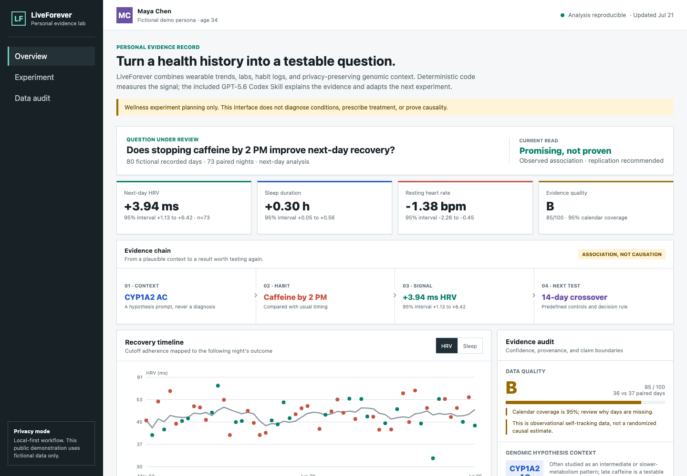
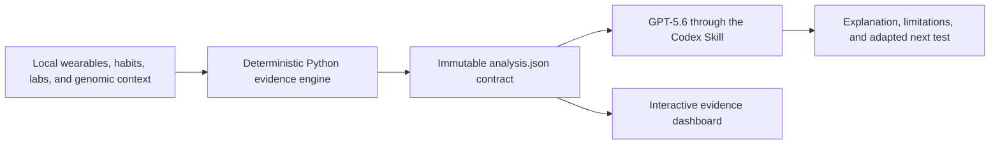

# LiveForever

### A privacy-first personal evidence lab for testable wellness experiments

> **OpenAI Build Week 2026 · Apps for Your Life**
> A public, synthetic-data extension of a private personal-health prototype, meaningfully built with Codex and GPT-5.6 during Build Week.

**[Open the live demo](https://bakulbadwal.github.io/liveforever-buildweek/)** · [Product case study](CASE_STUDY.md) · [Build Week provenance](docs/BUILD_WEEK_PROVENANCE.md) · [Technical method](docs/TECHNICAL_METHOD.md)

[](https://bakulbadwal.github.io/liveforever-buildweek/)

LiveForever combines longitudinal wearable signals, habit logs, laboratory trends, and cautious genomic context to answer one practical question at a time:

> What appears to affect my recovery, how uncertain is that signal, and how can I test it more carefully?

The hosted demo needs no login, API key, external health service, or live model call. Every visible record belongs to **Maya Chen, a fictional persona generated for this demonstration**. No personal health information appears in this repository.

## Try It In 30 Seconds

1. Follow the **Evidence Chain** from genomic context to habit, observed signal, and next test.
2. Toggle the recovery chart between **HRV** and **Sleep**, then inspect the calculation provenance.
3. Review the balanced **14-day replication plan**, controls, and decision rule.

The demo examines whether stopping caffeine by 2 PM is associated with better next-day recovery across 73 paired nights. It reports a `+3.94 ms` HRV difference with a 95% interval of `+1.13 to +6.42`, while labeling the result **promising, not proven**.

## What Makes It Different

- **One question, not a correlation fishing expedition:** each analysis defines an exposure, outcome, lag, and minimum sample before interpreting results.
- **Calculations outside the model:** Python owns effect sizes, intervals, lags, sample counts, missingness, correlations, PhenoAge, quality grades, and the initial experiment schedule.
- **GPT-5.6 inside a contract:** the included Codex Skill frames questions, reviews sources, explains fixed results, identifies blind spots, and adapts a plan without altering calculated values.
- **Uncertainty stays visible:** minimum-sample warnings, missingness, group balance, confidence intervals, and known confounders remain part of the product experience.
- **Genetics is context, not a verdict:** a synthetic CYP1A2 marker can prioritize a question but never determines a recommendation.
- **Local-first privacy:** raw health and genomic records remain local and outside model output, commits, screenshots, and the public demo.

## Built With Codex And GPT-5.6

### Starting point

Before Build Week, a private LiveForever prototype already handled personal data ingestion, longitudinal health tracking, PhenoAge, genomics, trend reports, and a private dashboard. That work was built with Claude Code and is not presented as Codex work. The private repository and all personal records remain separate.

### New during Build Week

Codex and GPT-5.6 were used to create this standalone public extension:

- Deterministic lagged N-of-1 comparisons and reproducible moving-block bootstrap intervals.
- Pearson correlation intervals, sample sufficiency checks, missingness checks, condition balance, and confounding warnings.
- A transparent evidence-quality score with explicit association-versus-causation boundaries.
- A fully synthetic wearable, habit, laboratory, and genomic dataset.
- A balanced 14-day replication planner with controls, stop conditions, and a predefined decision rule.
- A Codex Agent Skill defining GPT-5.6's source-review, explanation, safety, and experiment-adaptation responsibilities.
- A responsive interactive evidence dashboard, submission package, and 11 automated tests.

### How we collaborated

Codex inspected the private baseline without modifying it, verified its existing tests, reviewed the hackathon requirements, helped choose a focused extension, designed the model-versus-code responsibility boundary, implemented and tested the new engine, generated fictional fixtures, built and visually verified the interface, reviewed scientific sources, validated the Skill, and prepared the public submission.

The key human product decisions were to preserve the stronger longevity direction, submit only one project, make uncertainty and experiment design the differentiator, keep every personal record private, and use genetics only to prioritize questions rather than prescribe behavior.

The hosted website intentionally avoids a browser-side API key or backend model dependency. GPT-5.6 operates through the included Skill; the static demo remains fast, free to test, and reproducible. Full before-and-after documentation is in [BUILD_WEEK_PROVENANCE.md](docs/BUILD_WEEK_PROVENANCE.md).

## How It Works



| Layer | Responsibility |
|---|---|
| Deterministic Python | Effects, intervals, lags, quality checks, PhenoAge, schedule, and provenance |
| `analysis.json` | Immutable interface between calculation and interpretation |
| GPT-5.6 Skill | Question framing, source review, explanation, alternative hypotheses, and bounded plan adaptation |
| Web demo | Inspectable visualization of the fictional evidence record |

## Demonstration Record

The synthetic record spans 84 calendar days with 80 recorded days and reports:

- `+3.94 ms` next-day HRV, 95% interval `+1.13 to +6.42`
- `+0.30 h` sleep duration, 95% interval `+0.05 to +0.56`
- `-1.38 bpm` resting heart rate, 95% interval `-2.26 to -0.45`
- `73` paired nights with balanced conditions
- `95%` calendar coverage and a `B` evidence-quality grade
- A deterministic, balanced 14-day replication schedule

These are deliberately generated signals in synthetic data, not findings about a real person. One coherent persona keeps the end-to-end story inspectable; automated tests cover small samples, missing genomic markers, missing laboratory inputs, lag correctness, and other failure cases.

## Run It

Requires Python 3.11 or newer and has no runtime dependencies.

```bash
PYTHONPATH=src python3.11 -m liveforever_lab.cli
python3.11 -m http.server 8765 --directory demo
```

Open `http://localhost:8765`, or use the [hosted demo](https://bakulbadwal.github.io/liveforever-buildweek/).

Run the tests:

```bash
PYTHONPATH=src python3.11 -m unittest discover -s tests -v
```

To test the agent workflow, install this repository as a Codex Skill and invoke:

```text
$liveforever-evidence-lab Investigate whether my caffeine timing is associated with next-day recovery.
```

## Project Map

- [`src/liveforever_lab/`](src/liveforever_lab/) · Deterministic analysis, genomics, PhenoAge, synthetic data, and planning.
- [`SKILL.md`](SKILL.md) · GPT-5.6 workflow, responsibilities, forbidden behavior, and claim language.
- [`demo/`](demo/) · Static interactive application and generated analysis contract.
- [`tests/`](tests/) · Eleven focused tests for analysis and context behavior.
- [`docs/`](docs/) · Technical method, provenance, submission copy, demo script, and checklist.

## Privacy And Safety

- Real databases, profiles, exports, lab PDFs, genomic files, credentials, and intervention histories are excluded by design.
- The checked-in genome and laboratory fixtures are visibly marked synthetic.
- LiveForever supports wellness experiment planning, not diagnosis or treatment.
- Medication and supplement changes are outside the generated plan.
- Severe or concerning symptoms are a stop condition and require appropriate professional care.

## Scientific Context

- PhenoAge combines chronological age with nine routine clinical biomarkers. The implementation follows the published coefficients and remains an educational summary, not a clinical age or mortality prediction: [Levine et al. method discussed in PMC](https://pmc.ncbi.nlm.nih.gov/articles/PMC13015750/).
- CYP1A2 `rs762551` has been studied in caffeine metabolism, but reported effects vary by context and population. LiveForever uses it only to generate a hypothesis worth testing: [systematic review](https://pubmed.ncbi.nlm.nih.gov/29282363/) and [population-dependence meta-analysis](https://pubmed.ncbi.nlm.nih.gov/27173183/).

## License

MIT
